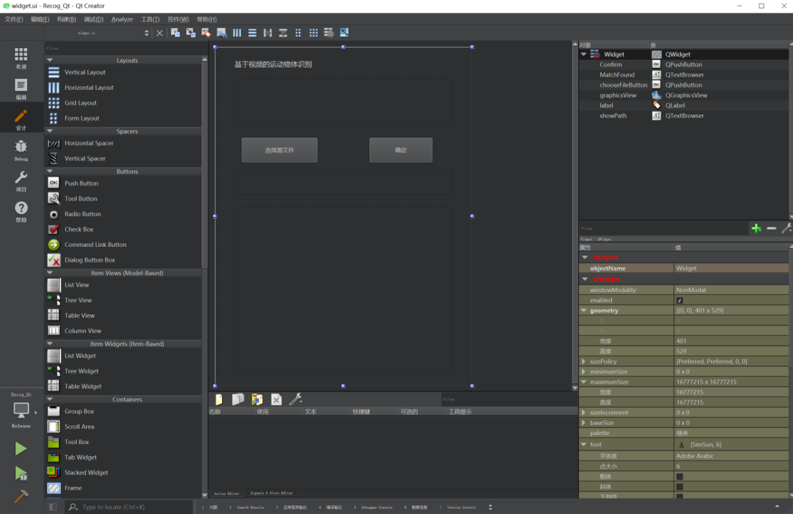
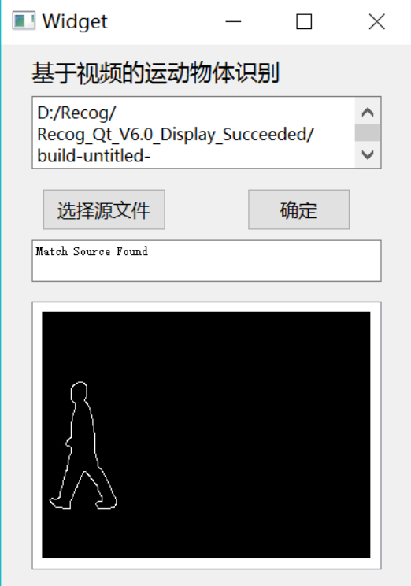
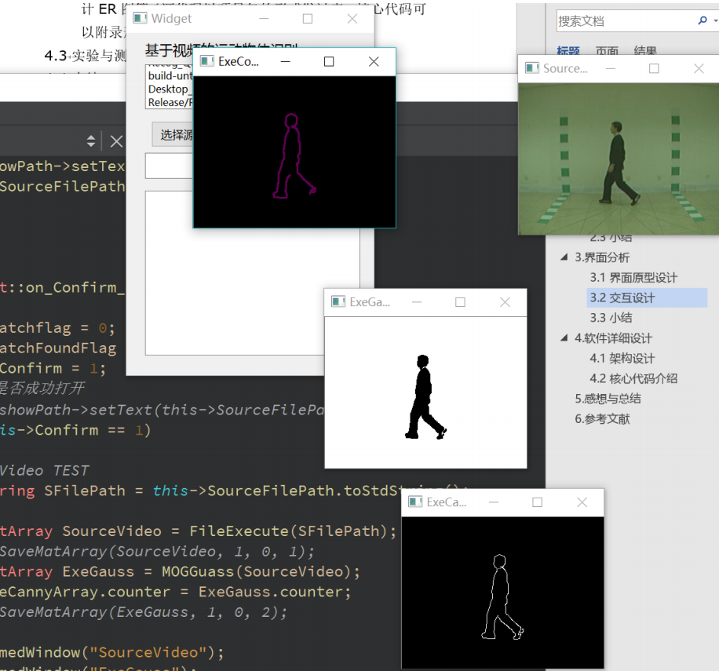

# Moving-Object-Recognition

- This is a moving object recognition project based on C++, Qt and OpenCV. 本项目基于C++，Qt，及OpenCV，实现了对运动目标的轮廓识别匹配

- Relevant Computer Vision Algorithms 相关计算机视觉算法
    - SIFT
    - SURF
    - Background Subtractor
    - Canny
    - Perceptual Hash

- Project Steps 项目步骤
    - Moving object detection 移动物体检测
    - Contour extraction 轮廓提取
    - Cross-comparison 交叉对比
        - Pre-store some contour drawings 将一些轮廓图提前存入库中
        - Compare the currently extracted contour with the contour in the library, and return the matching result according to the similarity threshold 将当前提取到的轮廓和库中轮廓进行对比，根据相似度阈值返回匹配结果

- Project Overview 项目概览
    - GUI Design 交互界面设计

        

    - Source Matches 成功匹配

        

    - No Match 未找到匹配

        

    - Intermediate Results 中间结果

        

- See full [report](Report.pdf)